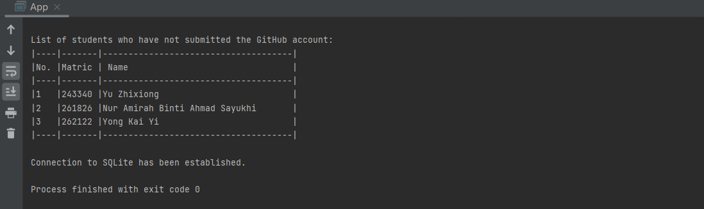
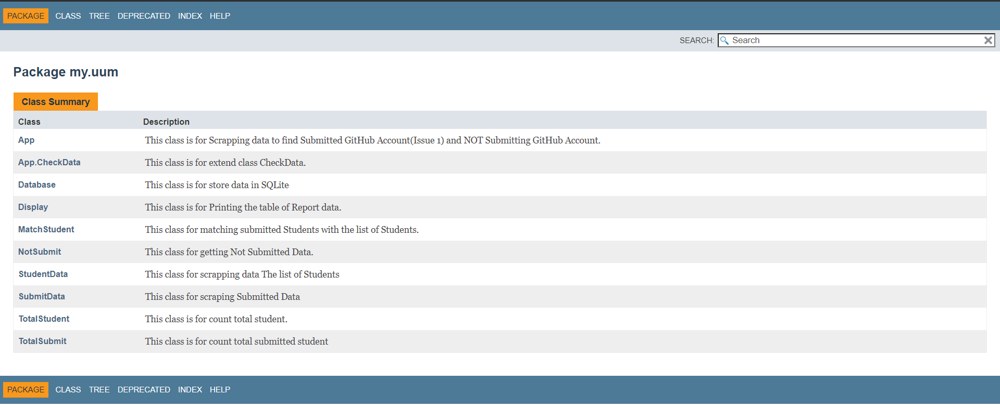

## Requirements for Assignment-1
[Read the instruction](https://github.com/STIW3054-A202/Assignments_and_Project/blob/main/Assignment-1.md)

## Your Info:
| NO | NAME                              |MATRIC NO| Image                                               |                
|----|-----------------------------------|---------|----------------------------------------------------------|
| 1  | Mohd Shukur Bin Zainol Abidin     | 262987  |                  |

## Introduction
The function of the system is to get the list of data who had submitted  and not submitted the task in issues 1. The programming language that used to developed the system is  maven and java. Database that used in the system to save all of the list of the students data is SQLite. The IDE used in the development of this system is IntelliJ.


## Flow Diagram of the requirements
  

## User manual/guideline for using the system
```
1. Installing dependency for Sqlite and Jsoup for Database and Web Scraping.
2. Create Table ListStudent with column data(Matric, Name, GitHub_Link,Status) to store data from web scraping
3. Read data from a Github Issue/1 page to scrape data who has submitted their GitHub account.
4. Read a list of student from a Github Wiki page to scrape a list of student.
5. Compare the data of Github Issue/1 and the list of student to get a list of students who have not submitted the GitHub account.
6. Printing the data of submitted students and not submitted students using class Display.java as a report.
7. Store the data of submitted students and not submitted students in Database(SQLite).
```

## Result/Output (Screenshot of the output)
 Table Database
  

 Output Submitted Student List
  

 Output Not Submitted Student List
  


## UML Class Diagram
  


## Youtube Presentation
## References (Not less than 10)
```
1. https://github.com/STIW3054-A202/Assignments_and_Project/blob/main/Assignment-1.md
2. Codota. (2019). Codota.com. 
    https://www.codota.com/code/java/methods/java.sql.Connection/createStatement
3. Processing SQL Statements with JDBC (The JavaTM Tutorials > JDBC Database Access > JDBC Basics). (2020). Oracle.com. https://docs.oracle.com/javase/tutorial/jdbc/basics/processingsqlstatements.html
4. The executeUpdate( ) Method. (2021). Java Programming with Oracle JDBC. O’Reilly Online Learning. https://www.oreilly.com/library/view/java-programming-with/059600088X/ch09s03.html
5. JDBC - Statement Object Example - Tutorialspoint. (2021). Tutorialspoint.com. https://www.tutorialspoint.com/jdbc/statement-object-example.htm#:~:text=int%20executeUpdate(String%20SQL)%3A,%2C%20UPDATE%2C%20or%20DELETE%20statement.
6. Java JDBC Insert Example: How to insert data into a SQL table | alvinalexander.com. (2020). Alvinalexander.com. https://alvinalexander.com/java/edu/pj/jdbc/jdbc0002/
7. Maven Repository: jsoup. (2020). Mvnrepository.com. https://mvnrepository.com/search?q=jsoup
8. Rungta, K. (2020). SQLite Tutorial for Beginners: Learn in 3 Days. Guru99.com; Guru99. https://www.guru99.com/sqlite-tutorial.html
9. SQLite In 5 Minutes Or Less. (2021). Sqlite.org. https://www.sqlite.org/quickstart.html
10. SQLite Java: Inserting Data. (2020, April 11). SQLite Tutorial. https://www.sqlitetutorial.net/sqlite-java/insert/
11. IntelliJ IDEA Help. (2021). IntelliJ IDEA Help. https://www.jetbrains.com/help/idea/class-diagram.html#manage_class_diagram
12. LibGuides: APA 7th Edition Citation Examples: General Rules. (2020). Umgc.edu. https://libguides.umgc.edu/apa-examples
```

## JavaDoc
 
